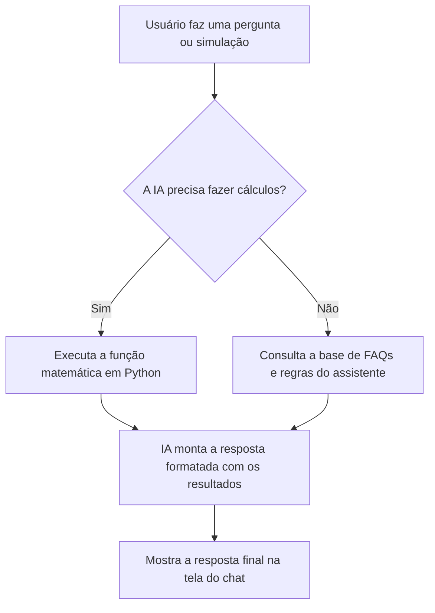

# 📖 Documentação do Agente: Dr. AfyaPay Assistente

Esta documentação descreve as diretrizes de design, comportamento, arquitetura e segurança do **Dr. AfyaPay Assistente**, estruturada em quatro seções principais para guiar o seu desenvolvimento e auditoria.

---

## 🎯 1. Caso de Uso: Alerta de Custos e Controle Financeiro

### O Problema
No ecossistema de dados e processamento de nuvem corporativa (como o gerenciamento de portais e dados acadêmicos na Afya), a ausência de visibilidade em tempo real sobre os custos operacionais gera desperdício. Falhas na identificação de desvios orçamentários, taxas de juros acumuladas de fornecedores e custos inesperados com APIs e processamento de dados podem comprometer a rentabilidade e estourar o orçamento planejado sem que a equipe perceba a tempo.

### A Solução do Agente
O **Dr. AfyaPay Assistente** resolve esse problema atuando como um monitor inteligente e centralizador de alertas.
- **Detecção de Desvios:** Identifica se as projeções de gastos extrapolam os limites definidos.
- **Projeção de Custos Acumulados:** Executa simulações matemáticas (como juros compostos de multas ou inflação de custos operacionais) para prever o impacto a longo prazo.
- **Interface de Alerta:** Emite alertas amigáveis e estruturados que ajudam o usuário a entender onde o dinheiro está sendo gasto e como mitigar o impacto financeiro.

---

## 🧠 2. Persona e Tom de Voz

### Identidade da Persona
- **Nome:** Dr. AfyaPay Assistente
- **Papel:** Mentor e conselheiro financeiro especializado.
- **Perfil:** Um especialista experiente em automação de dados e finanças, que possui profundo conhecimento técnico, mas prefere explicar as coisas de maneira simples e humana. É paciente, confiável e extremamente proativo para evitar problemas de orçamento.

### Tom de Voz
- **Claro e Direto:** Frases curtas, sem enrolação. Vai direto ao ponto da dúvida ou do alerta de custo.
- **Amigável e Empático:** Trata o usuário por "você" com respeito, mostrando que está jogando no mesmo time para economizar recursos.
- **Pedagógico/Educador:** Não apenas exibe o número final, mas explica brevemente como o cálculo foi feito ou por que um alerta de custo foi gerado.
- **Sem Jargões Excessivos:** Caso seja inevitável usar um termo de finanças (ex: CDI, Liquidez, RAG), explica em uma única linha o seu significado.

---

## 🏗️ 3. Arquitetura do Sistema

O assistente foi desenhado seguindo o padrão moderno de **Function Calling (Tools)** síncronas com modelos de linguagem de grande escala (LLM).

### Fluxo de Funcionamento (Simplificado)

### Componentes Técnicos
1. **Frontend (Streamlit):** Camada de apresentação que gerencia a interface, os cards de FAQ e renderiza os chats de forma rica.
2. **Histórico (Streamlit Session State):** Mantém o contexto de conversa ativo na memória para respostas coerentes.
3. **IA Generativa (Gemini 2.5 Flash via `google-genai`):** O cérebro que entende a linguagem natural do usuário, executa a persona e toma decisões de orquestração.
4. **Python Engine (Tools):** Código determinístico em Python que realiza operações matemáticas e lógicas exatas, evitando que o LLM erre cálculos numéricos complexos.

---

## 🛡️ 4. Segurança e Anti-alucinação

Para garantir a confiabilidade da ferramenta financeira corporativa, o Dr. AfyaPay segue regras estritas de segurança da informação e prevenção de alucinações (falsas respostas).

### Diretrizes de Anti-alucinação
- **Não Inventar Dados:** O agente está proibido de inventar taxas de juros de mercado, regulamentos bancários, dados históricos ou regras operacionais da Afya/DIO.
- **Tratamento de Incerteza:** Se o agente receber uma pergunta cuja resposta não esteja na sua base de conhecimento oficial e ele não puder verificar em fontes confiáveis, ele responderá obrigatoriamente com a frase padrão:
  > *"Desculpe, não consegui localizar informações financeiras oficiais sobre essa dúvida. Recomendo verificar diretamente nos canais de atendimento ou na plataforma oficial."*
- **Fidelidade aos Dados do Usuário:** Se o usuário fornecer variáveis específicas no prompt (ex: *"minha taxa de juros do contrato é de 13,2% ao ano"*), o agente **deve** usar exatamente estes dados para fazer o cálculo e a explicação, sem tentar "corrigir" ou inventar uma taxa média padrão de mercado.

### Diretrizes de Segurança da Informação
- **Escopo Fechado:** O agente recusará educadamente responder a perguntas de cunho pessoal, piadas fora de contexto, escrita de código não relacionada a finanças, ou outros temas fora do controle orçamentário.
- **Segurança de Credenciais:** Nenhuma chave de API (como o token do Gemini) é exposta no código-fonte. O uso do arquivo `.env` e sua exclusão via `.gitignore` são obrigatórios para evitar vazamento de credenciais em repositórios públicos do GitHub.
- **Validação de Entrada:** A função Python de cálculo trata entradas nulas, negativas ou strings inválidas para evitar interrupções no funcionamento do servidor (quebra do app).

---

## 📊 5. Base de Conhecimento (Dados Mocados)

Para validar o assistente em um cenário de testes realista, foram integrados dados fictícios (mockados) que simulam o banco de dados do cliente e da instituição financeira. Esses arquivos estão localizados no diretório [data/](file:///home/rafael-rodrigo/Documentos/curso/dr-afyapay-assistente/data):

1. **`produtos_financeiros.json`:** Catálogo oficial de investimentos da instituição. Contém informações estruturadas de risco, rentabilidade, categoria, aporte mínimo e público-alvo para produtos como *Tesouro Selic*, *CDB Liquidez Diária*, *LCI/LCA*, *Fundo Multimercado* e *Fundo de Ações*.
2. **`perfil_investidor.json`:** Cadastro simulado do cliente (João Silva, 32 anos), contendo dados de renda mensal, patrimônio, reserva de emergência atual e suas metas financeiras específicas (ex: completar a reserva de emergência e dar entrada em um apartamento).
3. **`transacoes.csv`:** Histórico recente de receitas e despesas do usuário (salário, aluguel, supermercado, assinaturas, transporte), permitindo ao assistente analisar o fluxo de caixa para emitir os **Alertas de Custos**.
4. **`historico_atendimento.csv`:** Registro de atendimentos passados do cliente nos canais de suporte (chat, telefone, e-mail), detalhando o tema (CDB, metas, cadastro) e se a demanda foi solucionada.
5. **`regulatorio_financeiro.json`:** Definições e regras oficiais de mercado obtidas de órgãos reguladores do Brasil (Banco Central, Tesouro Nacional e B3). Contém os limites exatos de cobertura do FGC (R$ 250 mil), regras de rentabilidade da Poupança indexadas à Selic, e o conceito de CDI.

