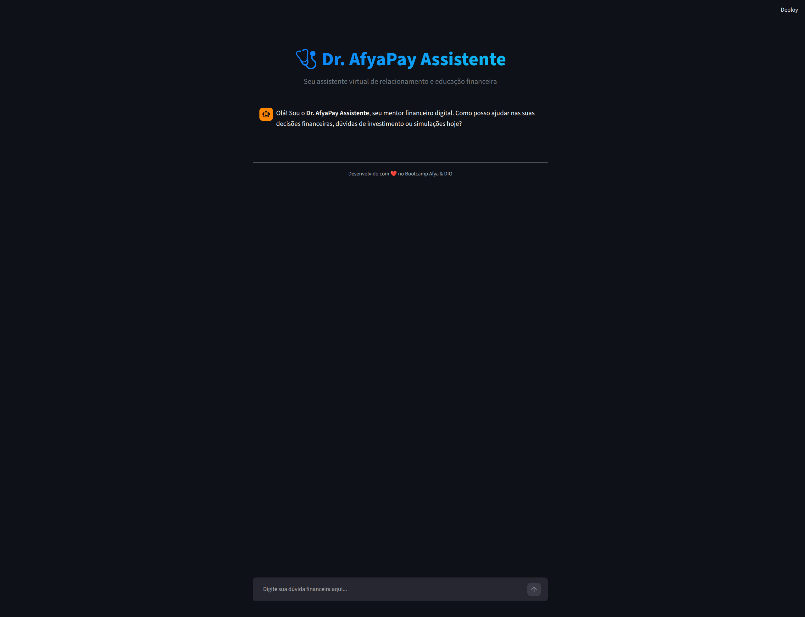

# Pitch

> [!TIP]
> Este roteiro foi pensado para uma apresentação objetiva, com apoio de slides e imagens da aplicação. A ideia é explicar o problema, mostrar a solução e destacar o diferencial técnico do agente.

---

## Roteiro Sugerido

### 1. O Problema

Muitas pessoas têm dificuldade para organizar a vida financeira, entender conceitos básicos de investimento e simular o impacto dos juros ao longo do tempo. Em finanças, respostas genéricas ou imprecisas podem gerar insegurança, decisões ruins e perda de confiança.

O **Dr. AfyaPay Assistente** resolve essa dor oferecendo um apoio simples, acessível e seguro para tirar dúvidas financeiras, explicar conceitos essenciais e realizar simulações matemáticas com clareza.

---

### 2. A Solução

O **Dr. AfyaPay Assistente** é um agente financeiro inteligente desenvolvido com **Python**, **Streamlit** e **Gemini**. Ele atua como um mentor financeiro digital, com uma persona clara, tom amigável e regras de segurança para evitar respostas inventadas.

A solução combina quatro elementos principais:

- **Chat com memória de sessão:** mantém o contexto da conversa durante o uso.
- **FAQ financeiro integrado:** responde dúvidas sobre reserva de emergência, renda fixa, renda variável e primeiros investimentos.
- **Function Calling:** quando o usuário pede uma simulação, o agente aciona uma função Python para calcular juros compostos.
- **Base de conhecimento mockada:** os arquivos da pasta `data/` representam perfil de investidor, produtos financeiros, transações, histórico de atendimento e regras regulatórias.

Com isso, o projeto mostra como IA generativa pode trabalhar junto com automação em Python para criar um atendimento financeiro mais claro, seguro e útil.

---

### 3. Demonstração

Na apresentação, a demonstração pode seguir esta sequência:

1. Abrir a aplicação **Dr. AfyaPay Assistente** no Streamlit.



2. Tela principal e a sidebar com FAQ e informações do projeto.


3. Fazer uma pergunta conceitual:

```text
O que é uma reserva de emergência?
```


4. Resposta estruturada do agente:

```text
Olá! Que ótimas perguntas para começarmos a organizar suas finanças!

Uma Reserva de Emergência é um valor que você guarda para usar em situações inesperadas, como despesas médicas urgentes, perda de emprego, conserto de carro ou qualquer imprevisto que possa surgir.

Características importantes:

- O ideal é ter de 3 a 6 meses do seu custo de vida mensal guardado.
- O dinheiro deve ficar em um local seguro.
- A aplicação precisa ter liquidez diária, para que você possa resgatar quando precisar.

Para quem está começando com pouco dinheiro, boas opções educativas são Tesouro Selic e CDBs com liquidez diária, sempre respeitando o perfil do investidor.
```

5. Fazer uma simulação financeira:

```text
Quero simular um investimento de R$ 5.000 a 10% ao ano por 5 anos.
```

```text
Com um investimento inicial de R$ 5.000,00 a uma taxa de 10% ao ano durante 5 anos, o montante final estimado será de R$ 8.052,55.

Isso significa um ganho aproximado de R$ 3.052,55 em juros ao longo do período.

Essa é uma simulação matemática baseada nos dados informados e não representa garantia de rendimento real.
```

6. O agente usa a ferramenta `calcular_juros_compostos`, executada em Python, para gerar o resultado.
7. O projeto possui documentação estruturada na pasta `docs/`: documentação do agente, base de conhecimento, prompts, avaliação e pitch.

Essa demonstração evidencia que o projeto não é apenas um chatbot. Ele possui persona, memória, regras de segurança, documentação, base mockada e uma ferramenta real de cálculo.

---

### 4. Diferencial e Impacto

O diferencial do **Dr. AfyaPay Assistente** está na combinação entre conversa natural e lógica determinística. O Gemini entende a intenção do usuário e gera respostas em linguagem acessível, enquanto o Python executa cálculos financeiros com mais precisão.

O impacto social está em tornar a educação financeira mais acessível. Um assistente como esse pode ajudar pessoas a entenderem reserva de emergência, investimentos iniciais, riscos e planejamento financeiro sem linguagem complicada.

Além disso, a arquitetura é evolutiva: os dados mockados podem ser integrados diretamente ao agente em versões futuras para gerar alertas de gastos, recomendações mais personalizadas e análises de perfil.

---

## Roteiro de Fala Resumido

```text
Olá, eu sou Rafael Rodrigo e este é o Dr. AfyaPay Assistente, meu projeto final do Bootcamp Afya de Automação de Dados com IA na DIO.

O problema que eu quis resolver é a dificuldade que muitas pessoas têm para entender conceitos financeiros, organizar decisões simples e simular investimentos com segurança. Em finanças, uma resposta errada ou inventada pode gerar insegurança e decisões ruins.

A solução é um agente financeiro inteligente desenvolvido com Python, Streamlit e Gemini. Ele funciona como um mentor financeiro digital, com uma persona amigável, memória de conversa, FAQ integrado e regras de segurança para reduzir alucinações.

Um dos diferenciais é o uso de Function Calling. Quando o usuário pede uma simulação de juros compostos, o Gemini entende a intenção e chama uma função Python, que faz o cálculo de forma determinística. Assim, o modelo não precisa inventar o resultado.

Na prática, o usuário pode perguntar o que é uma reserva de emergência, entender a diferença entre renda fixa e renda variável ou simular um investimento, por exemplo: R$ 5.000 a 10% ao ano por 5 anos.

O projeto também possui uma base mockada com perfil de investidor, produtos financeiros, transações, histórico de atendimento e regras regulatórias. Esses dados mostram como o agente pode evoluir para análises mais personalizadas no futuro.

O impacto da solução é tornar educação financeira mais acessível, clara e segura. O Dr. AfyaPay mostra como IA generativa e automação em Python podem trabalhar juntas para melhorar o relacionamento financeiro com o usuário.
```

---
